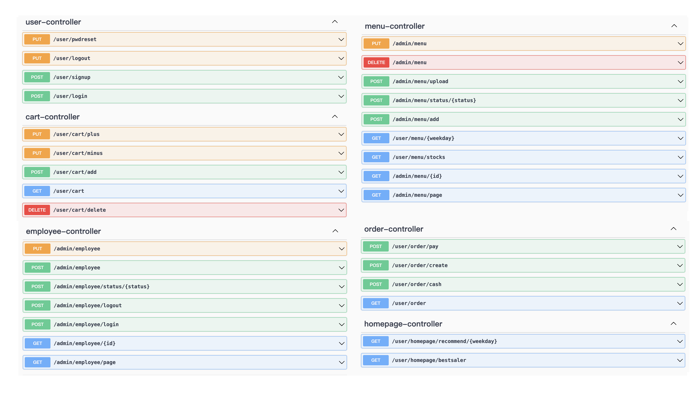
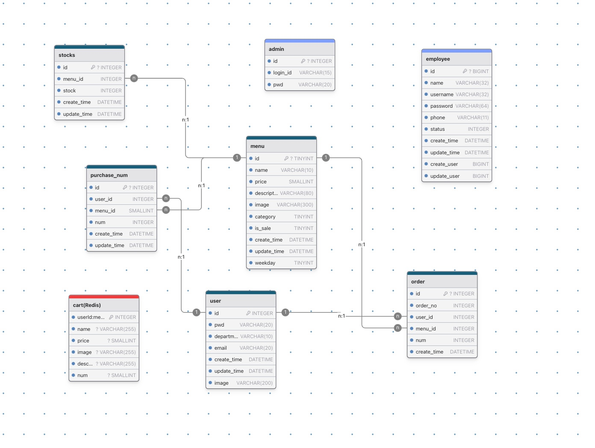

# Hi-Lunch （バックエンド）
## 背景と課題
会社の昼休み時間はわずか45分。近隣の飲食店は混雑し、ゆっくり食事をとることが難しいため、社内弁当が多くの従業員にとって最適な選択肢となっています。
しかし、社内弁当は、定時になると会社のある階の廊下で販売され、売り切れ次第撤去されます。支払いは現金のみの形です。私は弁当を買ったことが多くて、以下の課題を発見しました  

**(1)社員の視点から：昼休みの45分を高効率的に利用する為**
- 弁当の種類が事前にわからない：並ばないしかない  
- 在庫状況が不透明：売り切れが早すぎたり、逆に長時間売れ残ることもあり。会議が12時すぎまで伸びた場合、弁当の残り状況は現場にいくまでわからない  
- 現金決済の非効率性：お釣り対応に時間がかかる  

**(2)販売する人の視点から：社内弁当の管理効率を高める為**
- 新弁当の販売予測が難しい：たまに多い残りがあります  
- 紙での管理が負担：販売しながら手書で記録するのは煩雑  

これらの課題により、HiーLunchアプリケーションをデザインしました  
## 画面表示
社員向けの画面では、今週のメニューが確認でき、在庫状況もリアルタイムで把握できるほか、オンライ注文も可能。  

管理者向けの画面では、毎日の料理情報がアップロードでき、売り上げや販売数を可視化されたグラフで即座に確認できます。

## システム設計（System Design）
**1️⃣ショッピングカートの自動リセット**  
**課題**  
✅ ユーザーがカートに商品を入れたまま放置すると、翌日に注文データが残る  
  
**解決策**  
✅ Redisを導入し、カートのデータを 1日ごとに自動クリア（TTL 設定）  
✅ ユーザーごとのセッション管理にRedisを活用
  
**技術スタック**  
✅ Redis（キー・バリューストア）    
✅ TTL（Time-To-Live）設定 → 毎日0時にカートをクリア  

**2️⃣在庫管理（オーバーセール防止）**  
**課題**  
✅ 高トラフィックではないが、在庫管理の競合が発生する可能性  
✅ 同じ商品を複数ユーザーが同時に購入し、在庫オーバーが発生するリスク
  
**解決策**  
✅ 高並行処理ではないため、MySQL の悲観ロック（SELECT … FOR UPDATE）を使用  
✅ 同時購入時、在庫更新が完了するまで他のトランザクションをブロック
  
**技術スタック**  
✅ MySQL 悲観ロック（Pessimistic Locking）  
✅ トランザクション管理（Spring @Transactional）

**3️⃣ユーザー認証（JWT）**  
**課題**  
✅ ユーザーの認証情報を安全に管理し、セッションを維持する必要がある  
  
**解決策**  
✅ JWT（JSON Web Token） を使用して 認証を管理  
✅ アクセストークン（短期間）+ リフレッシュトークン（長期間） を活用し、セキュリティを強化
  
**技術スタック**  
✅ Spring Security + JWT 認証  
✅ アクセストークン + リフレッシュトークン管理  
## 機能紹介
**メイン機能**  
**（1）** 社員側  
- 今日のメニュー確認  
- 今週のメニュー確認
- カート
- マイページ
- マイオーダー
- Paypayでの注文

**（2）** 管理者側  
- データ可視化
- 料理情報管理（追加、編集、削除）
- 従業員情報管理（追加、編集、削除）

**認証機能**（共通内容）  
- ユーザー登録
- ログイン／ログアウト
- プロフィール編集

## テックステック
### UI  
- Figma

### Backend
- Java
- SpringBoot
- MyBatis
- MySQL
- Maven
- Swagger

## Others  
- RESTful API
- Postman
- Intelli Idea
- VsCode  
## APIドキュメント

## データベース

## 今後の課題
- フロントエンドの開発
- 並行：MQで解決
